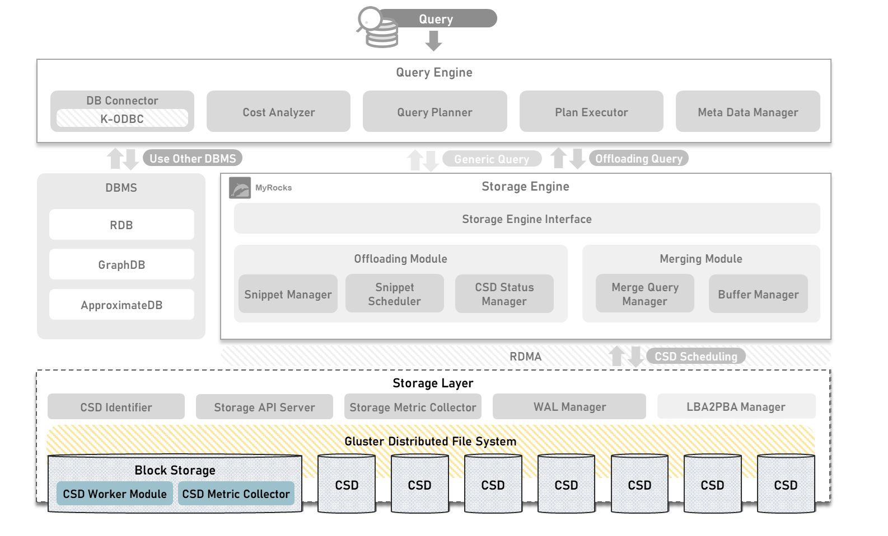

## Introduction of OpenCSD KETI-Block-Storage-Module
-------------
Modules that operate within the operational storage

Developed by KETI



## Contents
-------------
[1. Requirement](#requirement)

[2. Required Module](#required-module)

[3. How To Install](#module-description-and-how-to-create-a-container)

[4. Governance](#governance)

## Requirement
-------------
> NGD CSD

> RapidJSON

> aarch64 cross compiler

## Required Module
- *[RocksDB](https://github.com/facebook/rocksdb)*

## Module description and how to create a container
-------------
```bash
git clone https://github.com/opencsd/KETI-Storage-Controller-Module
cd CSD-Worker-Module
git submodule add https://github.com/facebook/rocksdb
```

### CSD-Worker-Module
-------------
```bash
cd CSD-Worker-Module
./1.build.sh cross
./2.send.sh cross
```
```bash
# in csd
cd CSD-Worker-Module
./container-processing.sh
```
#### CSD Input Interface
-------------
A module that receives the snippet delivered by the Storage Engine Node.

Parsing the received snippet and storing it in a structure that can be used inside the CSD

Check the snippet information, divide it into scan, scan&filter operations, and deliver it to the corresponding parallel execution queue

#### CSD Scanning
-------------
Module that reads table data inside CSD

Read data by accessing the block device as a PBA (Physical Block Address) rather than through the file system

#### CSD Filtering
-------------
Module that performs Where conditional filtering on blocks scanned by CSD Scanning

CSD Filtering module operates based on Where clause

<pre>
<code>
//loop row
for (int i = 0; i < rowcount; i++)
    {
        //loop whereclause
        for (int j = 0; j < whereclause.Size(); j++)
        {
            switch (whereclause operator)
                {
</code>
</pre>

#### CSD Merge Manager
-------------
Module that merges scanned and filtered data

Considering that the data will be reduced after the CSD Filtering module operates, the number of communication is reduced by combining blocks.

#### CSD Return Interface
-------------
A module that delivers the data merged by the CSD Merge Manager to the Buffer manager of the Storage Engine Node.

Merge information is delivered in JSON format, and merge data is delivered in raw data format.

### CSD-Metric-Collector
-------------
A module that collects CPU, memory, and network metrics from within the csd and periodically sends them to the storage metric collector.
```bash
cd CSD-Metric-Collector
./1.build.sh
./2.send.sh
```
```bash
# in csd
cd CSD-Metric-Collector
./container-processing.sh
```

## Governance
-------------
This work was supported by Institute of Information & communications Technology Planning & Evaluation (IITP) grant funded by the Korea government(MSIT) (No.2021-0-00862, Development of DBMS storage engine technology to minimize massive data movement)

